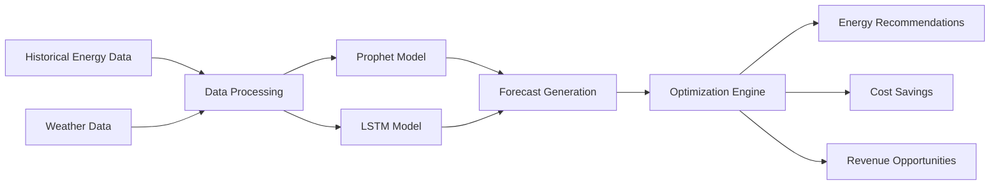
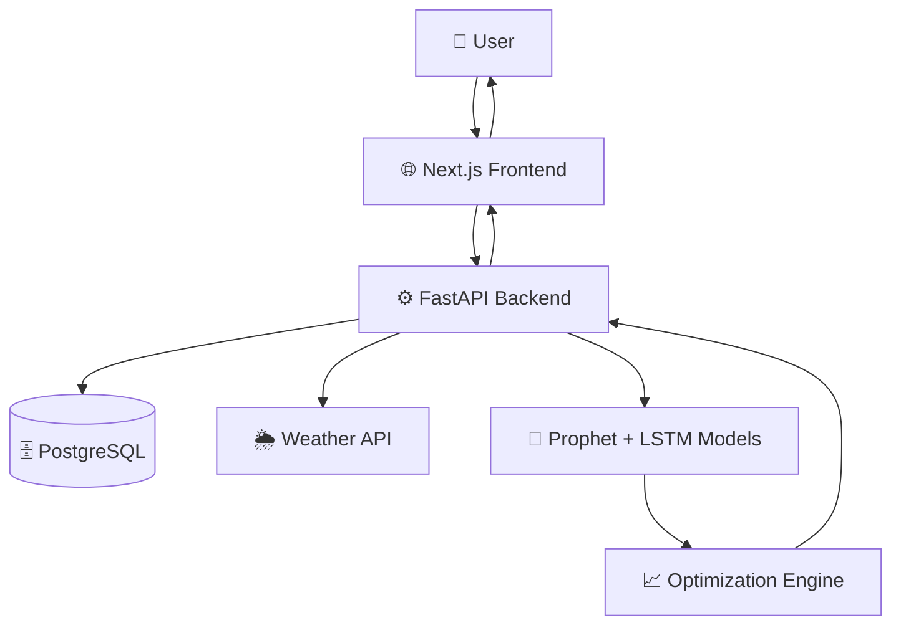

# 🚀 SOLIX — Transforming Rooftop Solar Into Intelligent Energy Revenue

<div align="center">


### ☀️ Smart Forecasting • Smart Optimization • Smart Revenue

**SOLIX is an AI-powered Energy Intelligence Platform that helps solar prosumers, households, and MSMEs forecast energy generation, optimize electricity usage, and maximize revenue from surplus solar energy.**

🌍 Built for Sustainable Energy Management

📈 Powered by Machine Learning Forecasting

⚡ Designed for Real-World Solar Users

</div>

---

# 🌐 Live Demo

### 🚀 Website

**🔗 [https://solix-black.vercel.app/](https://solix-black.vercel.app/)**

### 💻 Source Code

**🔗 [https://github.com/Gautham826/SOLIX](https://github.com/Gautham826/SOLIX)**

---

# 📖 Project Overview

Traditional solar monitoring systems only display historical energy consumption and generation data.

However, solar users still struggle with:

* Predicting future energy generation
* Optimizing electricity usage
* Understanding surplus energy opportunities
* Managing energy costs efficiently
* Participating in energy markets

SOLIX introduces an **AI-powered Energy Intelligence Layer** that transforms existing rooftop solar systems into smart, predictive, and revenue-generating assets.

The platform combines:

* Machine Learning Forecasting
* Weather Intelligence
* Energy Analytics
* Optimization Algorithms

to help users make intelligent energy decisions.

---

# 🎯 Problem Statement

In Tamil Nadu and many regions across India, rooftop solar users generate excess energy but often fail to utilize it effectively.

### Key Challenges

🔴 Rising Electricity Costs

🔴 Wastage of Surplus Solar Energy

🔴 Lack of Energy Forecasting Tools

🔴 No Intelligent Decision Support

🔴 Complex Net-Metering Policies

🔴 Limited Access to Energy Markets

Current systems focus only on monitoring.

**SOLIX focuses on prediction, optimization, and monetization.**

---

# ✨ Core Features

## ☀️ Solar Energy Forecasting

Predict future solar generation using:

* Historical consumption data
* Weather conditions
* Time-series forecasting

### ML Models

* Prophet
* LSTM Neural Networks

---

## 📊 Smart Energy Dashboard

Track:

* Energy Consumption
* Solar Generation
* Predicted Energy Output
* Cost Savings
* Performance Metrics

---

## 🤖 AI Recommendation Engine

Provides:

* Smart energy-saving suggestions
* Usage optimization tips
* Revenue maximization strategies

---

## ⚡ Cost Optimization

Linear Programming models help users:

* Reduce electricity bills
* Optimize power consumption
* Schedule energy usage efficiently

---

## 🌦 Weather Intelligence

Integrates weather data for:

* Better forecasting
* Solar production prediction
* Energy planning

---

## 📱 Fully Responsive Design

Optimized for:

* Desktop
* Tablet
* Mobile Devices

---

# 🧠 Machine Learning Pipeline



---

# 🏗️ System Architecture



---

# 🛠 Tech Stack

## Frontend

| Technology    | Purpose            |
| ------------- | ------------------ |
| Next.js       | Frontend Framework |
| React         | UI Development     |
| TypeScript    | Type Safety        |
| Tailwind CSS  | Styling            |
| ShadCN UI     | Components         |
| Framer Motion | Animations         |

---

## Backend

| Technology | Purpose          |
| ---------- | ---------------- |
| FastAPI    | REST APIs        |
| Python     | Backend Logic    |
| Docker     | Containerization |

---

## Machine Learning

| Technology   | Purpose                   |
| ------------ | ------------------------- |
| Prophet      | Time-Series Forecasting   |
| LSTM         | Deep Learning Forecasting |
| Scikit-Learn | ML Utilities              |
| Pandas       | Data Processing           |
| NumPy        | Numerical Computing       |

---

## Database

| Technology | Purpose      |
| ---------- | ------------ |
| PostgreSQL | Data Storage |

---

## Deployment

| Service           | Usage            |
| ----------------- | ---------------- |
| Vercel            | Frontend Hosting |
| Render            | Backend Hosting  |
| Render PostgreSQL | Database Hosting |

---

# 📂 Project Structure

```bash
SOLIX
│
├── frontend/
│   ├── app/
│   ├── components/
│   ├── hooks/
│   ├── public/
│
├── backend/
│   ├── api/
│   ├── models/
│   ├── forecasting/
│   ├── optimization/
│   ├── services/
│
├── database/
│
│
├── README.md
│
└── package.json
```

---

# ⚙️ Installation & Setup

## 1️⃣ Clone Repository

```bash
git clone https://github.com/Gautham826/SOLIX.git
```

---

## 2️⃣ Navigate to Project

```bash
cd SOLIX
```

---

## 3️⃣ Install Frontend Dependencies

```bash
npm install
```

---

## 4️⃣ Install Backend Dependencies

```bash
pip install -r requirements.txt
```

---

## 5️⃣ Configure Environment Variables

### Frontend

```env
NEXT_PUBLIC_API_URL=
```

### Backend

```env
DATABASE_URL=
WEATHER_API_KEY=
SECRET_KEY=
```

---

## 6️⃣ Run Frontend

```bash
npm run dev
```

---

## 7️⃣ Run Backend

```bash
uvicorn main:app --reload
```

---

# 📸 Screenshots

## 🏠 Landing Page

```md
Add Screenshot Here
```


---

## 📊 Dashboard

```md
Add Screenshot Here
```


---

## 🤖 AI Forecasting

```md
Add Screenshot Here
```


---

# 📈 Business Impact

### 💰 Cost Reduction

Reduce electricity costs by:

**15% – 25%**

through AI-driven optimization.

---

### ☀️ Improved Solar Utilization

Maximize usage of generated solar energy.

---

### 🌍 Environmental Impact

* Lower carbon emissions
* Promote renewable energy adoption
* Reduce dependence on fossil fuels

---

### 🏭 Industrial Benefits

* Better load balancing
* Reduced peak demand stress
* Smarter energy planning

---

# 🚀 Future Roadmap

* [x] Responsive UI Development
* [x] AI Forecasting Integration
* [x] Backend Deployment
* [x] Cloud Database Setup
* [ ] Real-Time Smart Meter Integration
* [ ] IoT Device Connectivity
* [ ] Energy Trading Marketplace
* [ ] AI Chat Assistant
* [ ] Mobile Application

---

# 👥 Team Details

## Team Name

### NEXAGRID

---

### Team Members

| Name          | Role                 |
| ------------- | -------------------- |
| Gautham       | Full Stack Developer |
| Dharini G     | UI/UX Designer       |
| Vishwa R K    | Backend Developer    |
| Yashawini M   | ML Engineer          |

> Replace with actual team member details.

---

# 📚 Research References

* Hybrid Prophet + LSTM Forecasting
* Electricity Demand Forecasting using Deep Learning
* AI for Prosumer Energy Systems
* Tamil Nadu Net Metering Policies

---

# 🏆 Why SOLIX?

✅ AI-Based Forecasting

✅ Real-World Problem Solving

✅ Renewable Energy Impact

✅ Full Stack + Machine Learning

✅ Cloud Deployed

✅ Industry-Relevant Architecture

✅ Scalable SaaS Model


---

<div align="center">

## ⭐ If you found SOLIX useful, give this repository a Star!

### ⚡ "Turning Solar Energy Into Smart Revenue"

Made with ❤️ by Team NEXAGRID

</div>


